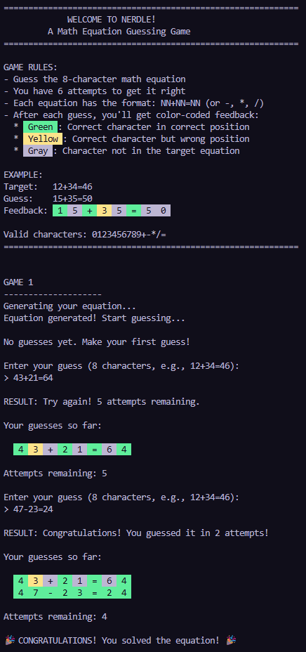
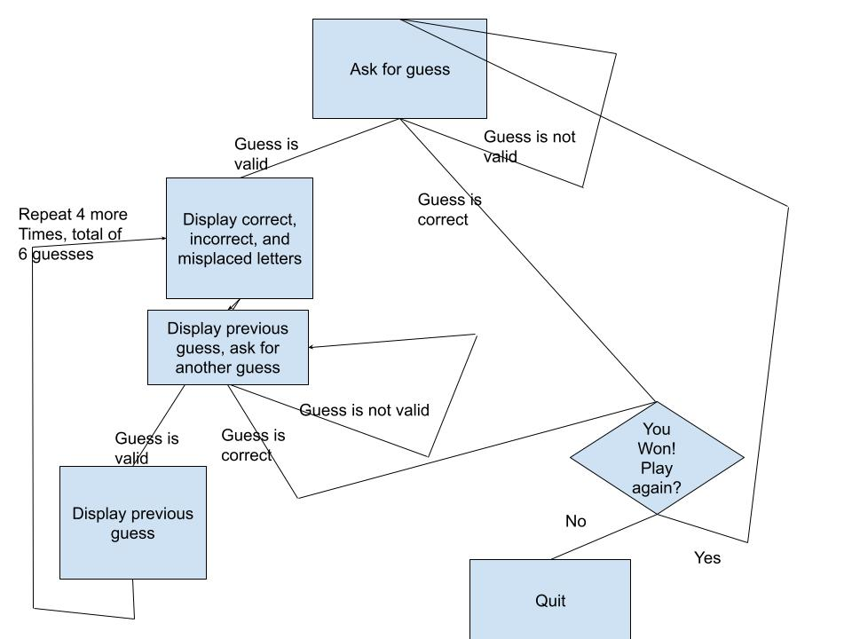

<!-- 
   Assignment Notes:
   - To run the game, execute `python3 nerdle.py` in the terminal.
   - Your task is to implement the equation generation functions in `equation_generator.py` and the solution validator in `game_engine.py`.
   - Don't forget to import your modules.
   - PAY ATTENTION TO THE TODO COMMENTS IN THE CODE.
   - Each function has comments detailing its purpose and requirements.
   - Code is automatically tested *every time* you push changes to GitHub.
-->

# Nerdle
This is a game about guessing the correct equation that the computer has generated!

## Requirements
- Tested and works with `Python 3.12.3`, but should work with `Python 3+`
- Built in `random` library for random number and equation generation
- Optional `pytest` library to test each function
- Be a little intelligent

## Installation and Usage
1. Clone this repo by running `git clone https://github.com/WTCSC/nerdle-Fooot-Code.git` into the directory where you want the files to go
2. Run nerdle.py: `python3 nerdle.py`
3. Have Fun!

## Testing
1. Install `pytest` (tested with version `8.3.3`)
2. Run pytest in the terminal in the same directory as all Python files

## Example Game

## Flow Chart of Game
